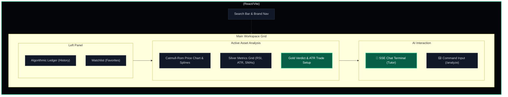
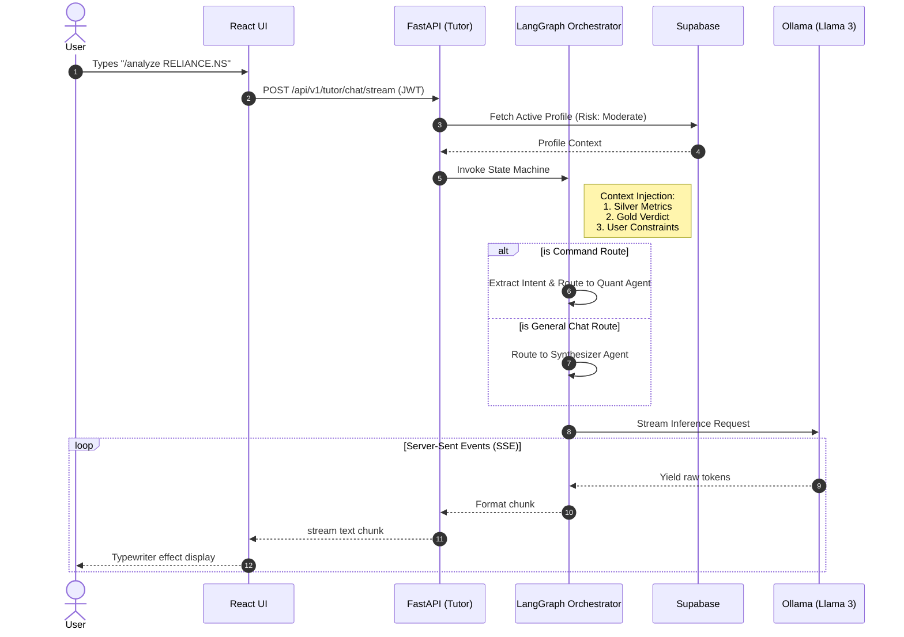
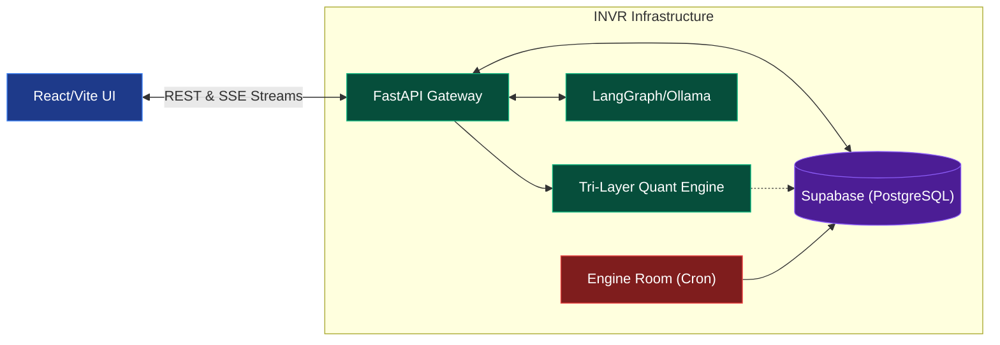
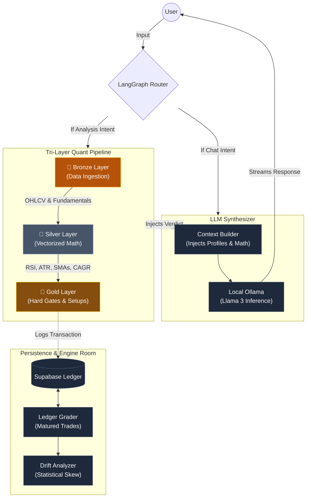

# INVR: Algorithmic Portfolio Analyzer Engine

**Enterprise-grade quantitative analysis and AI tutoring platform for financial markets**

INVR is a comprehensive algorithmic portfolio intelligence platform that fuses quantitative technical and fundamental analysis with an interactive LLM-powered financial tutor. Built for investors and traders who demand institutional-grade market screening, deterministic trade setups, and natural language portfolio insights.

## Preview

### Overview



### AI Tutor Terminal



### Architecture



## Key Features

- **Multi-Layer Analysis Pipeline** - Tri-layer architecture (Bronze, Silver, Gold) isolating data ingestion, mathematical vectorization, and deterministic verdict logic.
- **Hard Gate Validation** - Configurable threshold parameters governing secular trend validation, volatility limits, and cash flow stability.
- **Algorithmic Trade Setups** - Automated, mathematically driven generation of entry zones, stop losses, and target prices utilizing Average True Range (ATR) metrics.
- **Interactive AI Tutor** - Context-aware, SSE-streaming conversational agent orchestrated via LangGraph, capable of fundamental analysis, definition lookups, and portfolio simulations.
- **Hybrid Grading Engine** - Background drift analysis comparing historical algorithmic predictions against matured market outcomes to ensure continuous statistical accuracy.
- **Liquid Glass UI** - Premium, highly responsive React/Vite frontend featuring Framer Motion micro-animations and Three.js ambient particle physics.

## Quick Start

### Installation

```bash
# Clone the repository
git clone https://github.com/gh0gale/INVR.git
cd INVR

# Set up Python backend (FastAPI)
cd backend
python -m venv .venv
source .venv/bin/activate  # On Windows: .venv\Scripts\activate
pip install -r requirements.txt

# Set up React frontend (Vite + TypeScript)
cd ../frontend
npm install
```

### Basic Usage Flow (Example Use Case)

Meet **Aarav**, an intermediate swing trader looking to evaluate Reliance Industries (`RELIANCE.NS`) with a capital of ₹1,00,000.

1. **Onboarding**: Aarav sets up his secure profile. The system hashes this profile into a unique `semantic_hash` in Supabase, anchoring his risk tolerance (Moderate), experience level (Intermediate), and capital (₹100,000).
2. **Analysis Trigger**: In the INVR Workspace, Aarav types `/analyze RELIANCE` in the command terminal.
3. **Data Fetching (Bronze Layer)**: The FastAPI backend securely pulls historical OHLCV data, balance sheets, and institutional activity vectors for the asset, while checking real-time market circuit breakers.
4. **Metric Calculation (Silver Layer)**: The system executes Pandas-based vectorized math, instantly calculating localized momentum (RSI), price volatility (ATR), Moving Averages (20, 50, 200), and fundamental metrics (e.g., Book Value Growth, Free Cash Flow margins).
5. **Deterministic Verdict (Gold Layer)**: The pipeline evaluates the computed vectors against strict, hard-coded gate thresholds (e.g., ensuring price > 200 SMA). With secular trend requirements met and no overbought signals flagged, it produces a "BUY ON DIP" verdict alongside an ATR-calculated Trade Setup (Entry Zone, Target, Stop Loss). 
6. **AI Synthesis & Tutor Integration**: The LLM Synthesizer (via local Ollama) translates these metrics into a readable executive summary, bypassing hallucinations by strictly adhering to the injected Silver/Gold states. When Aarav asks: *"What if I allocate 50% of my portfolio to this?"* the LangGraph orchestrator intercepts the intent, routes it to the Portfolio Simulation node, and advises on diversification limits tailored to his predefined Moderate risk profile.
7. **Ledger Archival**: The entire transaction, alongside the synthesized verdict and baseline metrics, is quietly committed to the `algorithmic_ledger` table in Supabase for future grading.

## Architecture & Data Flow



## Core Systems Deep Dive

### 1. The Tri-Layer Quant Pipeline
- **Bronze (Ingestion)**: Handles reliable external API data ingestion with intelligent fallbacks, ensuring structural consistency before downstream processing.
- **Silver (Mathematics)**: Employs Pandas for highly performant, vectorized statistical analysis. Isolates math (CAGR, RSI, ATR, Moving Averages) entirely from business logic to maintain testability.
- **Gold (Logic)**: Applies the proprietary business rules and hard gates. Evaluates the Silver metrics against configurable thresholds located in `config/gate_thresholds.py` to yield a strict, non-probabilistic verdict.

### 2. LangGraph Orchestrator
- **State Machine Routing**: A multi-node Directed Acyclic Graph (DAG) that analyzes user intent and dynamically routes queries between distinct execution paths: News Analysis, Definition Lookups, Portfolio Modeling, or Core Analysis synthesis.
- **Context Injection**: Safeguards the LLM by explicitly injecting real-time Gold and Silver context blocks into the prompt templates, anchoring the AI's reasoning in mathematical reality.

### 3. The Engine Room (Background Evaluation)
- **Grade Ledger**: A background job that scans the `algorithmic_ledger` for matured predictions, querying live historical data to score the system's past recommendations as Wins, Losses, or Draws based on ATR-driven targets.
- **Drift Analysis**: Identifies statistical deviations by aggregating the graded ledger. If Win/Loss ratios for specific metrics (e.g., RSI thresholds, Volume requirements) skew negatively, the system proposes administrative recalibrations to the `gate_thresholds`.

### 4. Interactive Workspace (Frontend)
- **SSE Streaming Terminal**: Implements Server-Sent Events to provide real-time, typewriter-style token streaming directly from the FastAPI/Ollama backend.
- **Responsive Data Rendering**: Dynamically parses the active ledger entry to render interactive asset price charts (using SVG paths/Catmull-Rom splines), algorithmic zones, and system confidence metrics.

## Technology Stack

- **Frontend**: React 19, TypeScript, Vite, TailwindCSS, Framer Motion, @react-three/fiber
- **Backend**: Python 3.12+, FastAPI, Uvicorn, Pandas, NumPy
- **AI & Orchestration**: LangGraph, LangChain, Ollama (Local Llama 3)
- **Database & Auth**: Supabase (PostgreSQL)

## Project Structure

```text
INVR/
├── backend/              # Python FastAPI Application
│   ├── app/              # Core Application Logic
│   │   ├── api/          # Route definitions (Analytics, Profile, Tutor)
│   │   ├── pipeline/     # LangGraph workflows, nodes, and agents
│   │   └── services/     # Bronze, Silver, and Gold layer implementations
│   ├── config/           # Configurable thresholds and application settings
│   └── scripts/          # The Engine Room (Grading, Drift Analysis, Simulators)
│
├── frontend/             # React Vite Application
│   ├── src/
│   │   ├── components/   # Modular UI elements
│   │   ├── pages/        # Authentication, Onboarding, Workspace views
│   │   └── context/      # Global application state (AuthContext)
│   └── package.json      # Dependencies and scripts
│
└── tests/                # System verifications and mathematical unit tests
```

## Setup & Configuration

### 1. Configure Environment

**Backend (`backend/.env`):**
```env
SUPABASE_URL="https://your-project.supabase.co"
SUPABASE_ANON_KEY="your-anon-key"
SUPABASE_SERVICE_ROLE_KEY="your-service-role-key"
MARKET_SUFFIX=".NS"
```

**Frontend (`frontend/.env`):**
```env
VITE_SUPABASE_URL="https://your-project.supabase.co"
VITE_SUPABASE_ANON_KEY="your-anon-key"
VITE_API_BASE_URL="http://localhost:8000"
```

### 2. Start Services

**Terminal 1 (Backend):**
```bash
cd backend
uvicorn main:app --reload --port 8000
```

**Terminal 2 (Frontend):**
```bash
cd frontend
npm run dev
```
The application will be available at `http://localhost:5173`.

## Testing & Maintenance

### Run Unit Tests
Ensure the foundational math (like CAGR calculations) remains accurate:
```bash
cd backend
pytest tests/
```

### Evaluate System Drift
The Engine Room contains scripts to grade past predictions and analyze statistical drift in your configuration thresholds.
```bash
cd backend
python -m scripts.grade_ledger
python -m scripts.analyze_drift
```

## What Makes INVR Stand Out

1. **Deterministic Foundations** - AI is strictly used for synthesis and interaction; core financial verdicts are derived from hard, vectorized mathematics rather than opaque LLM inferences.
2. **Self-Evaluating** - The Engine Room grades the system's own past predictions, automatically highlighting drift and closing the feedback loop on algorithmic accuracy.
3. **Immersive UI** - The Liquid Glass design system provides a premium, low-latency environment featuring custom graphics that feel like a next-generation institutional trading terminal.
4. **Contextually Aware** - The LangGraph-powered AI Tutor remembers your financial goals, risk profile, and the mathematical reality of the active asset being analyzed.


## License

MIT License - see LICENSE file

---

**Built for the Intelligent Investor**

Start managing your portfolio with algorithmic precision today with INVR.
