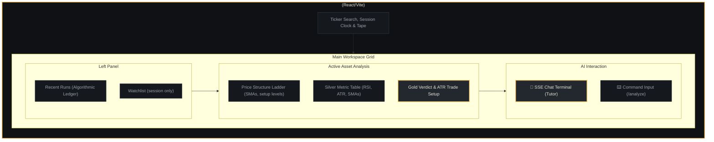
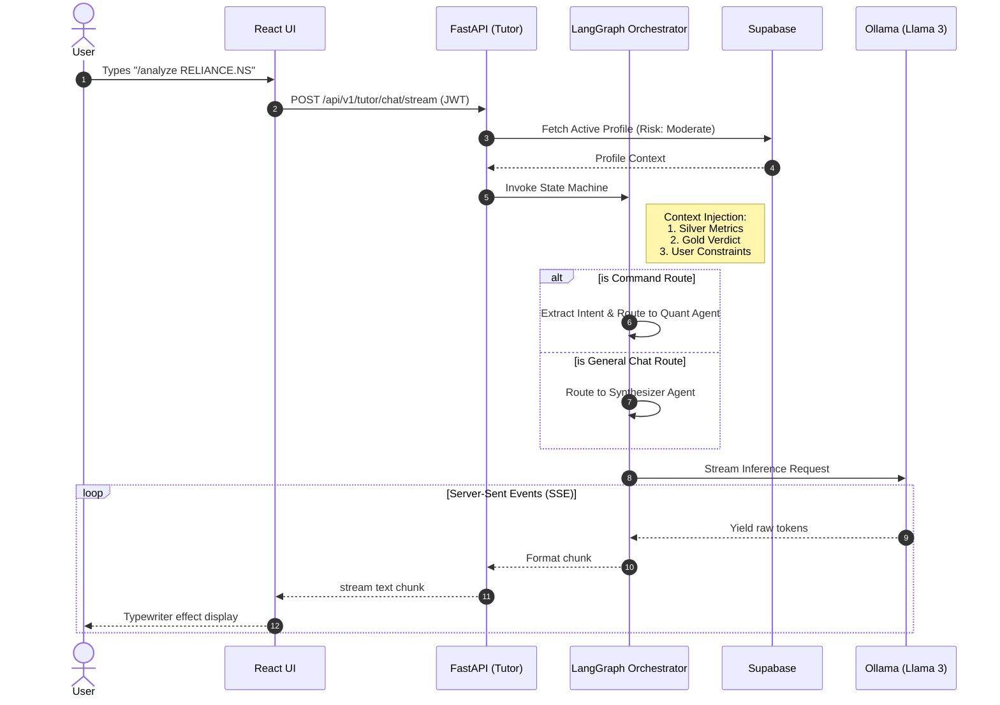
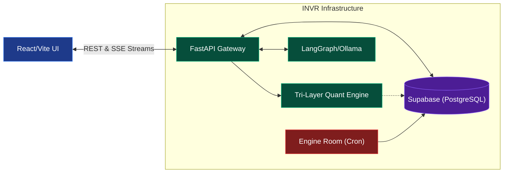
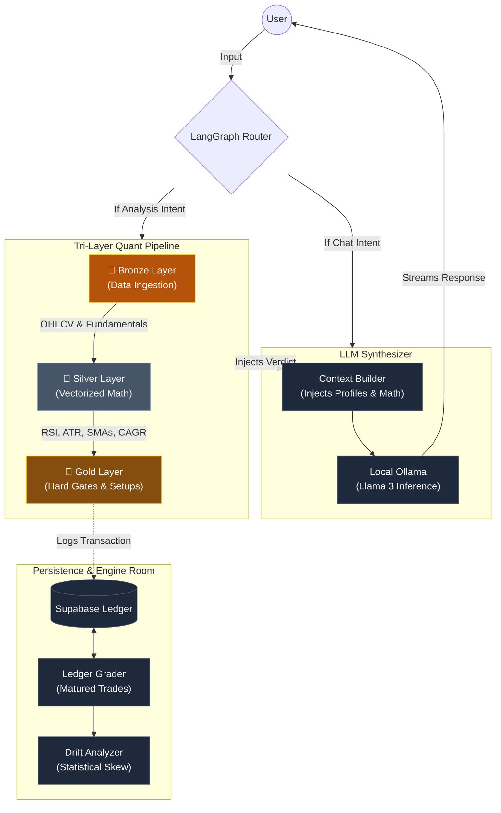

# INVR: Algorithmic Portfolio Analyzer Engine

**Enterprise-grade quantitative analysis and AI tutoring platform for financial markets**

INVR is a comprehensive algorithmic portfolio intelligence platform that fuses quantitative technical and fundamental analysis with an interactive LLM-powered financial tutor. Built for investors and traders who demand institutional-grade market screening, deterministic trade setups, and natural language portfolio insights.

## Preview

### Overview


```mermaid
flowchart TB
    classDef layout fill:#0F1114,stroke:#D9A03C,stroke-width:2px,color:#E8E4DA;
    classDef panel fill:#15181D,stroke:#3B434D,stroke-width:1px,color:#9BA1A8;
    classDef highlight fill:#23282F,stroke:#D9A03C,stroke-width:2px,color:#E8E4DA;
    
    subgraph UI["(React/Vite)"]
        direction TB
        TopNav["Ticker Search, Session Clock & Tape"]:::panel
        
        subgraph Workspace["Main Workspace Grid"]
            direction LR
            
            subgraph LeftCol["Left Panel"]
                direction TB
                Ledger["Recent Runs (Algorithmic Ledger)"]:::panel
                Watchlist["Watchlist (session only)"]:::panel
            end
            
            subgraph CenterCol["Active Asset Analysis"]
                direction TB
                Ladder["Price Structure Ladder (SMAs, setup levels)"]:::panel
                Metrics["Silver Metric Table (RSI, ATR, SMAs)"]:::panel
                Verdict["Gold Verdict & ATR Trade Setup"]:::highlight
            end
            
            subgraph RightCol["AI Interaction"]
                direction TB
                Terminal["🤖 SSE Chat Terminal (Tutor)"]:::highlight
                Input["⌨️ Command Input (/analyze)"]:::panel
            end
            
            LeftCol --> CenterCol
            CenterCol --> RightCol
        end
        
        TopNav --> Workspace
    end
    class UI layout
```

### AI Tutor Terminal


```mermaid
sequenceDiagram
    autonumber
    actor U as  User
    participant UI as  React UI
    participant API as  FastAPI (Tutor)
    participant LG as  LangGraph Orchestrator
    participant DB as  Supabase
    participant LLM as  Ollama (Llama 3)
    
    U->>UI: Types "/analyze RELIANCE.NS"
    UI->>API: POST /api/v1/tutor/chat/stream (JWT)
    API->>DB: Fetch Active Profile (Risk: Moderate)
    DB-->>API: Profile Context
    
    API->>LG: Invoke State Machine
    note right of LG: Context Injection:<br/>1. Silver Metrics<br/>2. Gold Verdict<br/>3. User Constraints
    
    alt is Command Route
        LG->>LG: Extract Intent & Route to Quant Agent
    else is General Chat Route
        LG->>LG: Route to Synthesizer Agent
    end
    
    LG->>LLM: Stream Inference Request
    
    loop Server-Sent Events (SSE)
        LLM-->>LG: Yield raw tokens
        LG-->>API: Format chunk
        API-->>UI: stream text chunk
        UI-->>U: Typewriter effect display
    end
```

### Architecture


```mermaid
flowchart LR
    classDef frontend fill:#1e3a8a,stroke:#3b82f6,color:#fff;
    classDef backend fill:#064e3b,stroke:#10b981,color:#fff;
    classDef db fill:#4c1d95,stroke:#8b5cf6,color:#fff;
    classDef engine fill:#7f1d1d,stroke:#ef4444,color:#fff;
    
    Client[" React/Vite UI"]:::frontend
    
    subgraph Cloud["INVR Infrastructure"]
        API[" FastAPI Gateway"]:::backend
        Quant[" Tri-Layer Quant Engine"]:::backend
        LLM[" LangGraph/Ollama"]:::backend
        DB[(" Supabase (PostgreSQL)")]:::db
        Engine[" Engine Room (Cron)"]:::engine
        
        API --> Quant
        API <--> LLM
        API <--> DB
        Quant -.-> DB
        Engine --> DB
    end
    
    Client <-->|REST & SSE Streams| API
```

## Key Features

- **Multi-Layer Analysis Pipeline** - Tri-layer architecture (Bronze, Silver, Gold) isolating data ingestion, mathematical vectorization, and deterministic verdict logic.
- **Hard Gate Validation** - Configurable threshold parameters governing secular trend validation, volatility limits, and cash flow stability. Money inputs are constrained at the schema and clamped again at the point of use, so a nonsensical capital figure yields no trade setup rather than a negative position size.
- **Algorithmic Trade Setups** - Automated, mathematically driven generation of entry zones, stop losses, and target prices utilizing Average True Range (ATR) metrics.
- **Interactive AI Tutor** - Context-aware, SSE-streaming conversational agent orchestrated via LangGraph, offering tailored Indian market context, stock-linked definitional explanations, and strict "Header: Content" structured output.
- **Hybrid Grading Engine** - Background drift analysis comparing historical predictions against matured market outcomes via a dedicated LangGraph state machine (`engine_room_graph.py`). Grader and simulator share one rule, every verdict including `MONITOR` is scoreable, and threshold changes are proposed from bootstrap intervals rather than a formula that only counted rows.
- **End-to-End Observability** - OpenTelemetry & Arize Phoenix telemetry tracing root API requests, LangGraph node steps, and linking financial outcome scores to LLM generation spans.
- **Terminal Interface** - React/Vite frontend built on a trading-terminal design system: charcoal surfaces, a single amber accent, hairline rules, monospaced figures, a live NSE session clock, a ticker tape of real ledger rows, and a scroll-advanced walkthrough of one real pipeline run. Every animation reports a fact; none is decorative.

## Quick Start

### Installation

```bash
# Clone the repository
git clone https://github.com/gh0gale/INVR.git
cd INVR

# Set up Python backend (FastAPI)
cd backend
python -m venv .venv
source .venv/bin/activate  # On Windows: .venv\Scripts\activate
pip install -r requirements.txt

# Set up React frontend (Vite + TypeScript)
cd ../frontend
npm install
```

### Basic Usage Flow (Example Use Case)

Meet **Aarav**, an intermediate swing trader looking to evaluate Reliance Industries (`RELIANCE.NS`) with a capital of ₹1,00,000.

1. **Onboarding**: Aarav sets up his secure profile. The system hashes this profile into a unique `semantic_hash` in Supabase, anchoring his risk tolerance (Moderate), experience level (Intermediate), and capital (₹100,000).
2. **Analysis Trigger**: In the INVR Workspace, Aarav types `/analyze RELIANCE` in the command terminal.
3. **Data Fetching (Bronze Layer)**: The FastAPI backend securely pulls historical OHLCV data, balance sheets, and institutional activity vectors for the asset, while checking real-time market circuit breakers.
4. **Metric Calculation (Silver Layer)**: The system executes Pandas-based vectorized math, instantly calculating localized momentum (RSI), price volatility (ATR), Moving Averages (20, 50, 200), and fundamental metrics (e.g., Book Value Growth, Free Cash Flow margins).
5. **Deterministic Verdict (Gold Layer)**: The pipeline evaluates the computed vectors against strict, hard-coded gate thresholds (e.g., ensuring price > 200 SMA). With secular trend requirements met and no overbought signals flagged, it produces a "BUY ON DIP" verdict alongside an ATR-calculated Trade Setup (Entry Zone, Target, Stop Loss). 
6. **AI Synthesis & Tutor Integration**: The LLM Synthesizer (via local Ollama) translates these metrics into a readable executive summary, bypassing hallucinations by strictly adhering to the injected Silver/Gold states and formatting responses in clean "Header: Content" sections. When Aarav asks: *"What if I allocate 50% of my portfolio to this?"* the LangGraph orchestrator intercepts the intent, routes it to the Portfolio Simulation node, and advises on diversification limits tailored to his predefined Moderate risk profile.
7. **Ledger Archival**: The entire transaction, alongside the synthesized verdict, baseline metrics, and OpenTelemetry `trace_id`, is quietly committed to the `algorithmic_ledger` table in Supabase for future grading.

## Architecture & Data Flow


```mermaid
flowchart TD
    classDef bronze fill:#b45309,stroke:#fbbf24,color:#fff;
    classDef silver fill:#475569,stroke:#94a3b8,color:#fff;
    classDef gold fill:#854d0e,stroke:#facc15,color:#fff;
    classDef base fill:#1e293b,stroke:#475569,color:#fff;

    User((User)) -->|Input| Router{"LangGraph Router"}
    
    subgraph TriLayer ["Tri-Layer Quant Pipeline"]
        direction TB
        B["🥉 Bronze Layer<br>(Data Ingestion)"]:::bronze
        S["🥈 Silver Layer<br>(Vectorized Math)"]:::silver
        G["🥇 Gold Layer<br>(Hard Gates & Setups)"]:::gold
        
        B -->|OHLCV & Fundamentals| S
        S -->|RSI, ATR, SMAs, CAGR| G
    end
    
    subgraph AI ["LLM Synthesizer"]
        direction TB
        Context["Context Builder<br>(Injects Profiles & Math)"]:::base
        Ollama["Local Ollama<br>(Llama 3 Inference)"]:::base
        Context --> Ollama
    end
    
    Router -->|If Analysis Intent| TriLayer
    Router -->|If Chat Intent| AI
    TriLayer -->|Injects Verdict| Context
    
    subgraph DataLayer ["Persistence & Engine Room"]
        direction LR
        DB[("Supabase Ledger")]:::base
        Drift["Drift Analyzer<br>(Statistical Skew)"]:::base
        Grader["Ledger Grader<br>(Matured Trades)"]:::base
        
        DB <--> Grader
        Grader --> Drift
    end
    
    G -.->|Logs Transaction| DB
    Ollama -->|Streams Response| User
```

## Core Systems Deep Dive

### 1. The Tri-Layer Quant Pipeline
- **Bronze (Ingestion)**: Handles reliable external API data ingestion with intelligent fallbacks, ensuring structural consistency before downstream processing.
- **Silver (Mathematics)**: Employs Pandas for highly performant, vectorized statistical analysis. Isolates math (CAGR, RSI, ATR, Moving Averages) entirely from business logic to maintain testability.
- **Gold (Logic)**: Applies the proprietary business rules and hard gates. Evaluates the Silver metrics against configurable thresholds located in `config/gate_thresholds.py` to yield a strict, non-probabilistic verdict.

### 2. LangGraph Orchestrator
- **State Machine Routing**: A multi-node Directed Acyclic Graph (DAG) that analyzes user intent and dynamically routes queries between distinct execution paths: News Analysis, Definition Lookups, Portfolio Modeling, or Core Analysis synthesis.
- **Context Injection & Formatting**: Safeguards the LLM by explicitly injecting real-time Gold and Silver context blocks into the prompt templates, forcing Indian market contextualization and strict "Header: Content" response formatting.

### 3. The Engine Room (Background Evaluation)
- **Grade Ledger**: Scans `algorithmic_ledger` for matured predictions and scores them against real market highs and lows using the ATR levels the user was actually shown. The live grader and the historical simulator call the same function (`scripts/_grading.py`), so backtest and production outcomes land in one comparable distribution.
- **Every verdict is scoreable**: bullish calls are judged on reaching target, bearish calls on the drop they warned about, and `MONITOR` on whether a decisive move happened at all. When both levels are touched in one window the tie resolves against the prediction, so the record errs pessimistic rather than flattering.
- **Drift Analysis & HITL Loop**: Seven of nine thresholds have a drift check. Each resamples the winning trades to build a bootstrap interval and proposes a change only when the configured gate sits outside it. Recalibrations route through the human-in-the-loop interrupt in `engine_room_graph.py` and are recorded in `GATE_THRESHOLDS_HISTORY`.

### 4. Interactive Workspace (Frontend)
- **SSE Streaming Terminal**: Implements Server-Sent Events to stream tutor tokens from the FastAPI/Ollama backend, with a blinking caret while the stream is open.
- **Real Data Only**: Renders the active ledger entry as a price-structure ladder (last price against its moving averages and the ATR-derived setup levels), a metric table, gate results, and the written explanation. The client is never sent a price series, so no chart is drawn from one.

## Technology Stack

- **Frontend**: React 19, TypeScript, Vite, TailwindCSS (no icon, animation, or charting library)
- **Backend**: Python 3.12+, FastAPI, Uvicorn, Pandas, NumPy
- **AI & Orchestration**: LangGraph, LangChain; models via Ollama locally (Llama 3.1) or Groq with Gemini failover
- **Observability**: OpenTelemetry SDK, Arize Phoenix (`telemetry.py`)
- **Database & Auth**: Supabase (PostgreSQL)

## Project Structure

```text
INVR/
├── backend/              # Python FastAPI Application
│   ├── app/              # Core Application Logic
│   │   ├── api/          # Route definitions (Analytics, Profile, Tutor)
│   │   ├── guardrails/   # Prompt injection & security guardrails
│   │   ├── pipeline/     # LangGraph workflows (tutor_graph, engine_room_graph, memory_graph)
│   │   ├── services/     # Bronze, Silver, Gold, Ledger, Memory, Profile services
│   │   └── telemetry.py  # OpenTelemetry & Arize Phoenix tracing setup
│   │   └── prompts.py    # Prompt versions and per-model token ceilings
│   ├── config/           # Configurable thresholds (gate_thresholds.py)
│   ├── migrations/       # SQL applied by hand (001_ledger_rls.sql)
│   ├── scripts/          # The Engine Room, incl. the shared _grading.py rule
│   └── tests/            # 273 unit tests, no Ollama or network required
│
├── frontend/             # React Vite Application
│   ├── src/
│   │   ├── components/   # Icons, skeletons, site chrome, analysis primitives
│   │   ├── pages/        # Landing, Auth, Onboarding, Workspace, Terms, Privacy
│   │   ├── context/       # Auth provider and useAuth hook
│   │   └── index.css     # Design tokens and shared component classes
│   └── package.json      # Dependencies and scripts
│
├── docs/                 # Blueprint, audits, deployment plan, evaluation tracker
└── .claude/              # Agent rules (incl. the frontend design rules), memory, skills
```

## Setup & Configuration

### 1. Configure Environment

Both directories ship a `.env.example` documenting every variable. Copy it and
fill in the values:

```bash
cp backend/.env.example backend/.env
cp frontend/.env.example frontend/.env
```

**Backend (`backend/.env`):**
```env
SUPABASE_URL="https://your-project.supabase.co"
SUPABASE_ANON_KEY="your-anon-key"
SUPABASE_SERVICE_ROLE_KEY="your-service-role-key"
MARKET_SUFFIX=".NS"
```

**Frontend (`frontend/.env`):**
```env
VITE_SUPABASE_URL="https://your-project.supabase.co"
VITE_SUPABASE_ANON_KEY="your-anon-key"
VITE_API_BASE_URL="http://localhost:8000"
```

### 2. Start Services

**Terminal 1 (Backend):**
```bash
cd backend
uvicorn main:app --reload --port 8000
```

**Terminal 2 (Frontend):**
```bash
cd frontend
npm run dev
```
The application will be available at `http://localhost:5173`.

### 3. Apply the database policy

```bash
supabase db execute -f backend/migrations/001_ledger_rls.sql
```

This is not optional before anyone else uses the instance. It leaves reads open
(ledger rows describe securities and carry no user identifier) and revokes every
client-side write, protecting the prediction history the grading loop depends on.

## Testing & Maintenance

### Run the test suite

273 tests covering the Gold verdict logic, ATR trade-setup arithmetic, prompt
interpolation, the shared grading rule, ledger versioning and the drift
statistics, that persisted values fit their columns, that one account's analysis
history stays its own, that fundamental ratios are normalised to the unit their
threshold uses, that no configured threshold is left unread by any gate, that
model-provider failover reaches the fallback (including mid-stream), that rate
limits are per account rather than per address, that no gate scores data that
was never fetched, that the tutor's scope boundary is a rule, and that the
figures in a narrative are checked against the engine's.
None of them need Ollama, Supabase, an API key or a network connection.

```bash
cd backend
pytest tests/                        # all 273, about 15 seconds
python -m scripts.data_coverage      # real market data: which gates actually ran
pytest tests/test_gold_gates.py -v   # one file
```

They also run automatically on every push and pull request touching `backend/`
via `.github/workflows/tests.yml`.

### Apply the database policies

These migrations must be run by hand against a new deployment. On the current
database they are already applied.

```bash
# Supabase SQL editor, or:
supabase db execute -f backend/migrations/001_ledger_rls.sql
supabase db execute -f backend/migrations/003_user_scoped_history.sql
```

**001** revokes client writes on `algorithmic_ledger`. Without it the browser
can delete rows from the shared record the Engine Room grades against.

**002** is optional and only normalises a column width — see the file.

**003** adds `prediction_interactions.user_id` and enables row-level security on
`chat_sessions` and `user_profiles`. Without it the anon key that ships in the
browser bundle can read every user's conversation text and capital amount, and
the workspace cannot tell one account's analysis history from another's.

**004** creates the `watchlists` table. Without it the star button in the
workspace logs an error and the list stays empty.

### Verify the whole system end to end

With the server running, a model provider available (Ollama locally, or Groq /
Gemini keys in `.env`) and the migrations applied:

```bash
cd backend
python e2e_verify.py
INVR_API_BASE=https://<app>.onrender.com python e2e_verify.py   # against a deployment
```

It drives the live stack - real auth, real pipeline, real Supabase, the real
model provider, real yfinance - and prints PASS or FAIL for each shipped feature
with the evidence it used. 35 checks. This is the check that found four defects
the unit suite could not see.

What is done and what is left, phase by phase, is tracked in
`docs/system_evaluation_prompt.md`.

### Deploy

The zero-cost deployment (Cloudflare Workers static assets, Render, Supabase, Groq with Gemini
failover) and every manual step it needs are in `docs/deployment_plan.md`. The
backend ships as `backend/Dockerfile`, described for Render by `render.yaml`.

### Evaluate system drift

The Engine Room grades past predictions and looks for thresholds the evidence no
longer supports. A change is proposed only when the configured gate falls
outside a bootstrap interval of what winning trades actually did.

```bash
cd backend
python -m scripts.grade_ledger        # score matured predictions against real prices
python -m scripts.analyze_drift       # propose threshold changes, with intervals
python -m scripts.trigger_engine_room # human-in-the-loop approval
```

### Versioning the ruleset

`PIPELINE_VERSION` is `RULESET_VERSION` plus a SHA-256 fingerprint of
`GATE_THRESHOLDS`. Editing any threshold produces a new version automatically,
so predictions made under different rules are never graded as one cohort. Bump
`RULESET_VERSION` by hand only for logic changes a threshold cannot express,
such as adding a gate or changing an override.

## What Makes INVR Stand Out

1. **Deterministic Foundations** - AI is strictly used for synthesis and interaction; core financial verdicts are derived from hard, vectorized mathematics rather than opaque LLM inferences.
2. **Self-Evaluating** - The Engine Room grades the system's own past predictions, automatically highlighting drift and closing the feedback loop on algorithmic accuracy.
3. **Legible UI** - A trading-terminal design system: figures set in monospace so columns align, colour reserved for direction and verdict meaning, and every async surface carrying a real loading state. Motion is limited to what reports something, and each animation is documented against the fact it conveys in `.claude/rules/frontend.md`.
4. **Contextually Aware** - The LangGraph-powered AI Tutor remembers your financial goals, risk profile, and the mathematical reality of the active asset being analyzed.


## License

MIT License - see LICENSE file

---

**Built for the Intelligent Investor**

Start managing your portfolio with algorithmic precision today with INVR.
