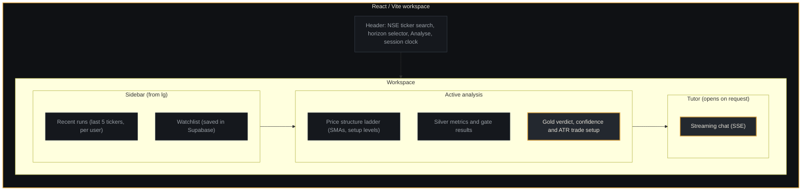
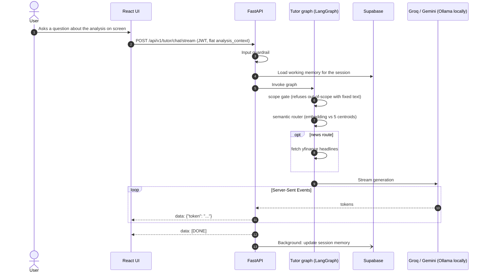
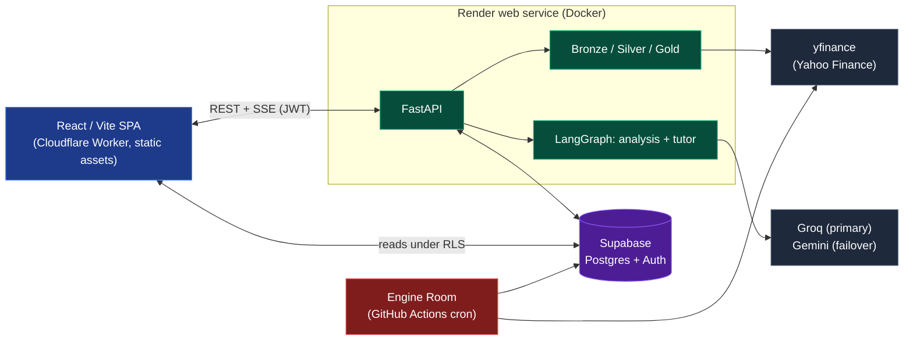

# INVR: Algorithmic Portfolio Analyzer Engine

**Quantitative analysis of NSE-listed equities, with an AI tutor that explains the result**

INVR runs a deterministic quantitative pipeline over a stock and explains the outcome. Technical and fundamental data are turned into gate results, a verdict, a confidence score and an ATR-based trade setup by fixed arithmetic. A language model then narrates those figures and answers questions about them in a streaming tutor. The model never decides the verdict and never calculates a level.

Coverage is Indian equities listed on the NSE (`SYMBOL.NS`). The product is for education and is not investment advice.

## Preview

### Workspace layout


```mermaid
flowchart TB
    classDef layout fill:#0F1114,stroke:#D9A03C,stroke-width:2px,color:#E8E4DA;
    classDef panel fill:#15181D,stroke:#3B434D,stroke-width:1px,color:#9BA1A8;
    classDef highlight fill:#23282F,stroke:#D9A03C,stroke-width:2px,color:#E8E4DA;

    subgraph UI["React / Vite workspace"]
        direction TB
        Header["Header: NSE ticker search, horizon selector, Analyse, session clock"]:::panel

        subgraph Grid["Workspace"]
            direction LR

            subgraph LeftCol["Sidebar (from lg)"]
                direction TB
                Recent["Recent runs (last 5 tickers, per user)"]:::panel
                Watchlist["Watchlist (saved in Supabase)"]:::panel
            end

            subgraph CenterCol["Active analysis"]
                direction TB
                Ladder["Price structure ladder (SMAs, setup levels)"]:::panel
                Metrics["Silver metrics and gate results"]:::panel
                Verdict["Gold verdict, confidence and ATR trade setup"]:::highlight
            end

            subgraph RightCol["Tutor (opens on request)"]
                direction TB
                Chat["Streaming chat (SSE)"]:::highlight
            end

            LeftCol --> CenterCol
            CenterCol --> RightCol
        end

        Header --> Grid
    end
    class UI layout
```

### Tutor request


```mermaid
sequenceDiagram
    autonumber
    actor U as User
    participant UI as React UI
    participant API as FastAPI
    participant LG as Tutor graph (LangGraph)
    participant DB as Supabase
    participant LLM as Groq / Gemini (Ollama locally)

    U->>UI: Asks a question about the analysis on screen
    UI->>API: POST /api/v1/tutor/chat/stream (JWT, flat analysis_context)
    API->>API: Input guardrail
    API->>DB: Load working memory for the session
    API->>LG: Invoke graph
    LG->>LG: scope gate (refuses out-of-scope with fixed text)
    LG->>LG: semantic router (embedding vs 5 centroids)
    opt news route
        LG->>LG: fetch yfinance headlines
    end
    LG->>LLM: Stream generation
    loop Server-Sent Events
        LLM-->>API: tokens
        API-->>UI: data: {"token": "..."}
    end
    API-->>UI: data: [DONE]
    API-)DB: Background: update session memory
```

### Architecture


```mermaid
flowchart LR
    classDef frontend fill:#1e3a8a,stroke:#3b82f6,color:#fff;
    classDef backend fill:#064e3b,stroke:#10b981,color:#fff;
    classDef db fill:#4c1d95,stroke:#8b5cf6,color:#fff;
    classDef engine fill:#7f1d1d,stroke:#ef4444,color:#fff;
    classDef ext fill:#1e293b,stroke:#475569,color:#fff;

    Client["React / Vite SPA<br>(Cloudflare Worker, static assets)"]:::frontend

    subgraph Render["Render web service (Docker)"]
        API["FastAPI"]:::backend
        Quant["Bronze / Silver / Gold"]:::backend
        Graphs["LangGraph: analysis + tutor"]:::backend
        API --> Quant
        API --> Graphs
    end

    DB[("Supabase<br>Postgres + Auth")]:::db
    LLMs["Groq (primary)<br>Gemini (failover)"]:::ext
    YF["yfinance<br>(Yahoo Finance)"]:::ext
    Engine["Engine Room<br>(GitHub Actions cron)"]:::engine

    Client <-->|"REST + SSE (JWT)"| API
    Client <-->|"reads under RLS"| DB
    API <--> DB
    Quant --> YF
    Graphs --> LLMs
    Engine --> DB
    Engine --> YF
```

## Key Features

- **Bronze / Silver / Gold pipeline.** Bronze fetches only what the chosen horizon needs, Silver is pure vectorised pandas, and Gold applies a horizon-specific set of 5 to 6 pass/warn/fail gates, resolves a verdict and applies three overrides. A gate whose input was never fetched does not vote.
- **Four horizons.** Intraday, swing, positional and long-term each fetch different data and apply different gates. The workspace remembers the horizon you last ran each stock on.
- **Deterministic verdict and confidence.** Confidence is a weighted gate-pass ratio mapped onto 50 to 95. After the model's JSON is parsed, verdict and confidence are overwritten from Gold, and the figures in the narrative are scored against the engine's.
- **ATR trade setup.** Entry zone, stop and target from Average True Range, with position size limited to 2% risk and clamped to the user's capital. Long-term runs have no setup.
- **Streaming tutor.** A LangGraph agent with a deterministic scope gate, an embedding router (definition, portfolio, scenario, news, fallback), an optional news tool and per-session memory.
- **NSE ticker search.** The header field is an autocomplete over `/api/v1/symbols/search` (Yahoo search through `yfinance`, NSE equities only). Only a searched symbol is ever run.
- **Watchlist and history per user.** Both are stored in Supabase and protected by row-level security.
- **First-login workspace tour.** Completion is stored on the profile, so another device does not replay it.
- **Engine Room.** A daily grader scores matured predictions against real highs and lows, a weekly drift analyzer proposes threshold changes from bootstrap intervals, and a human approves any change through a LangGraph interrupt.
- **Hosted models with failover.** Groq primary, Gemini fallback, and a deterministic narrative if both fail. Ollama is supported for local development.
- **Observability.** OpenTelemetry spans (with LangChain auto-instrumentation) to an OTLP collector such as Arize Phoenix. The trace id is stored on each ledger row.
- **Terminal interface.** Charcoal surfaces, one amber accent, hairline rules, a live NSE session clock, a ticker tape of real ledger rows, and a scroll-advanced walkthrough of one real pipeline run. No icon, animation or charting library.

## How a run works

1. **Onboarding.** A new user answers six questions (experience, goal, default horizon, risk, allocation, capital). The backend stores them in `user_profiles` with a `profile_version_hash`.
2. **Search and horizon.** The user searches for a company or NSE symbol and picks a match. The horizon selector shows the horizon saved for that stock, or the onboarding horizon if none.
3. **Analyse.** The workspace posts `{ticker, timeframe, user_profile, session_id}` to `POST /api/v1/analytics/process` with the Supabase JWT.
4. **Bronze.** yfinance price history for the horizon's period and interval, plus fundamentals, the sector index and NSE circuit status where the horizon asks for them.
5. **Silver.** SMAs, Wilder RSI and ATR, sector relative strength, market regime and horizon-specific fundamentals.
6. **Gold.** Gates, verdict, overrides, confidence and trade setup.
7. **Synthesis.** The model writes a JSON tear sheet from the Silver and Gold state. It is validated against a schema, retried up to twice on failure, and its verdict and confidence are replaced by Gold's.
8. **Ledger.** The backend writes the `algorithmic_ledger` row and the user's `prediction_interactions` row before responding, and returns the row's `log_id`. The workspace reads that exact row from Supabase and renders it.
9. **Tutor.** Questions go to the streaming tutor with a flat `analysis_context` built from the displayed row.

## Core Systems

### 1. The quant pipeline (`backend/app/orchestrator.py`)

`fetch_data → quant_engine → llm_synthesizer → validate_synthesis → (retry | END)` as a LangGraph state machine.

- **Bronze** (`services/bronze_service.py`) follows the manifest in `pipeline/router.py`. Optional fetches run concurrently, so one failing degrades the result instead of failing the request.
- **Silver** (`services/silver_service.py`) has no I/O and no business logic. Most unit tests target it.
- **Gold** (`services/gold_service.py`) reads every threshold from `config/gate_thresholds.py`.
- **Synthesis** is cached for six hours, keyed on the prompt, model identity, profile, verdict and Silver state.

### 2. The tutor (`backend/app/pipeline/tutor_graph.py`)

`scope → (refuse | router → (news_tool) → generate)`. Routing is not an LLM call: the message is embedded and matched to the nearest of five precomputed centroids, falling back below a confidence threshold. Out-of-scope questions (system internals, off-topic) are refused with fixed text and no model call. Every request first passes an input guardrail (regex block list, then a model classifier that fails closed in `block` mode).

### 3. The Engine Room (`backend/scripts/`, `backend/app/pipeline/engine_room_graph.py`)

- **Grade ledger** resolves `PENDING` rows past maturity (swing 15 days, positional 90, long-term 365) into `WIN`, `LOSS` or `DRAW` using the one rule in `scripts/_grading.py`, shared with the simulator. Intraday runs are not graded.
- **Drift analysis** needs 30 or more graded rows. Each of the 10 thresholds is checked by resampling the winning trades into a bootstrap interval, and a change is proposed only when the configured gate falls outside it. Proposals are written to `threshold_insights`.
- **Approval** is manual (`python -m scripts.trigger_engine_room`). The graph interrupts before `human_review`, and an approved change rewrites `config/gate_thresholds.py` and prepends to `GATE_THRESHOLDS_HISTORY`.

### 4. The workspace (`frontend/src/pages/Workspace.tsx`)

Renders the ledger row the backend returned: a price-structure ladder built from real moving averages and setup levels, a metric table, gate results, and the narrative. The client is never sent a price series, so no chart is drawn. The tutor stays closed until asked for; from `lg` it docks beside the result and can open after each run (a switch in its header turns that off).

## Technology Stack

- **Frontend:** React 19, TypeScript, Vite 8, Tailwind CSS 3.4, `react-router-dom` 7, `@supabase/supabase-js`. No icon, animation or charting library.
- **Backend:** Python 3.12+, FastAPI, Uvicorn, pandas, `slowapi` for rate limiting.
- **AI and orchestration:** LangGraph, LangChain. Models: `openai/gpt-oss-120b` and `-20b` on Groq, Gemini flash models as failover, Llama 3.1 through Ollama for local use. Router embeddings: Gemini `gemini-embedding-001` (768 dimensions) or Ollama `nomic-embed-text`.
- **Market data:** `yfinance` for prices, fundamentals and news headlines; `nsepython` for NSE circuit status (often unavailable, see Limitations).
- **Observability:** OpenTelemetry SDK, OpenInference LangChain instrumentation, any OTLP HTTP collector.
- **Database and auth:** Supabase (Postgres and GoTrue).
- **Hosting:** Cloudflare Worker (frontend), Render (backend), GitHub Actions (CI and the Engine Room schedule).

## Project Structure

```text
INVR/
├── .github/workflows/    # tests.yml (pytest, lockfile drift, Docker build), engine_room.yml (cron)
├── render.yaml           # Render blueprint for the backend
├── backend/
│   ├── main.py           # FastAPI app: telemetry, CORS, limiter, routers, /health
│   ├── Dockerfile        # python:3.12-slim, non-root, uvicorn on $PORT
│   ├── app/
│   │   ├── api/          # deps.py (JWT) and routes: analytics, profile, tutor, horizons, symbols
│   │   ├── guardrails/   # Input injection patterns, tutor scope gate
│   │   ├── integrations/ # yfinance and nsepython wrappers
│   │   ├── pipeline/     # router, tutor_graph, memory_graph, engine_room_graph
│   │   ├── schemas/      # Pydantic contracts
│   │   ├── services/     # bronze, silver, gold, grounding, ledger, memory, profile, guardrail, cache
│   │   ├── tools/        # News headlines for the tutor
│   │   ├── config.py, llm.py, embeddings.py, prompts.py, rate_limit.py, telemetry.py, orchestrator.py
│   ├── config/           # gate_thresholds.py (machine-edited by the Engine Room)
│   ├── migrations/       # 001 to 005, applied by hand
│   ├── scripts/          # Engine Room and utilities
│   └── tests/            # 309 unit tests, no network needed
├── frontend/
│   ├── wrangler.jsonc    # Cloudflare Worker static-assets deploy
│   ├── src/
│   │   ├── components/   # analysis, TutorPanel, SymbolSearch, Horizons, Tour, TickerTape, ...
│   │   ├── lib/          # Pure logic tested with node --test (horizons, symbols, runFlow, tourSteps)
│   │   ├── pages/        # Landing, Auth, Onboarding, Workspace, Terms, Privacy
│   │   ├── context/      # Auth provider and useAuth
│   │   └── api.ts        # The one backend origin, apiJson, symbol and horizon calls
│   └── tests/            # 8 tests on src/lib
├── docs/                 # Blueprint, audits, deployment plan, evaluation tracker (local only)
└── .claude/              # Agent rules, memory, skills (local only)
```

`.gitignore` ignores `*.md`, so only `README.md` is tracked. `CLAUDE.md`, `docs/` and the `.claude/` markdown exist locally unless force-added.

## API

All routes except `/` and `/health` need `Authorization: Bearer <Supabase access token>`.

| Route | Purpose | Limit (per user) |
|---|---|---|
| `GET /health` | Configuration only: cache, database client, model chain. Never calls Supabase or a model | none |
| `GET /api/v1/profiles/` | Caller's profile (404 if none) | none |
| `POST /api/v1/profiles/` | Create or update the profile (201) | none |
| `POST /api/v1/profiles/tour` | Mark the workspace tour done | none |
| `POST /api/v1/analytics/process` | Run the pipeline, write the ledger, return `log_id` | 10/min |
| `POST /api/v1/tutor/chat/stream` | Tutor answer as Server-Sent Events | 30/min |
| `GET /api/v1/horizons/stock/{ticker}` | Saved horizon for a stock | 120/min |
| `PUT /api/v1/horizons/stock/{ticker}` | Save the horizon for a stock | 60/min |
| `GET /api/v1/symbols/search?q=` | NSE ticker suggestions (24 h cache) | 60/min |

Interactive docs are at `/docs` (`/` redirects there).

## Setup

### Prerequisites

- Python 3.12+ and [`uv`](https://docs.astral.sh/uv/) (or `pip`)
- Node.js ^20.19 or >= 22.12 (Vite 8)
- A Supabase project with the tables from Appendix B of `docs/master_documentation.md` and the migrations below applied
- A model provider: Groq and Google API keys, or a local Ollama with `llama3.1` and `nomic-embed-text` pulled

### Install

```bash
git clone https://github.com/gh0gale/INVR.git
cd INVR

cd backend
python -m venv .venv
source .venv/bin/activate        # Windows: .venv\Scripts\activate
pip install -r requirements.txt  # or: uv sync

cd ../frontend
npm install
```

### Configure

Both directories ship a `.env.example` documenting every variable.

```bash
cp backend/.env.example backend/.env
cp frontend/.env.example frontend/.env
```

**Backend (`backend/.env`).** The Supabase trio is required; the app raises at import without it.

| Variable | Default | Purpose |
|---|---|---|
| `SUPABASE_URL`, `SUPABASE_ANON_KEY`, `SUPABASE_SERVICE_ROLE_KEY` | none | Required. The service-role key bypasses RLS and must never reach the browser |
| `MARKET_SUFFIX` | `.NS` | Appended to bare tickers |
| `LLM_PROVIDER` | `ollama` | `ollama`, `groq` or `gemini` |
| `LLM_FALLBACK_PROVIDER` | blank | Blank disables failover. Production uses `gemini` |
| `GROQ_API_KEY`, `GOOGLE_API_KEY` | blank | Provider keys |
| `EMBEDDING_PROVIDER` | `ollama` | `ollama` or `gemini`. Must match the committed router centroids |
| `LLM_MODEL_SYNTHESIS` / `_TUTOR` / `_MEMORY` / `_GUARDRAIL` / `_SCOPE` | blank | Per-task override of the primary model |
| `OLLAMA_BASE_URL`, `LLM_TIMEOUT_SECONDS`, `EMBEDDING_MODEL` | see `config.py` | Local model server, request timeout, embedding override |
| `GUARDRAIL_MODE` | `block` | `block` or `log_only` |
| `ROUTER_MODE`, `ROUTER_CONFIDENCE_THRESHOLD` | `enforce`, `0.45` | Tutor routing |
| `CORS_ALLOW_ORIGINS` | `http://localhost:5173` | Comma-separated exact origins |
| `RATE_LIMIT_STORAGE_URI` | `memory://` | Per worker; a Redis URL shares limits |
| `OTEL_EXPORTER_OTLP_ENDPOINT` | `http://localhost:6060/v1/traces` | OTLP collector; spans are dropped with a warning if nothing listens |
| `TEST_USER_EMAIL`, `TEST_USER_PASSWORD` | blank | Only for the live harnesses |

**Frontend (`frontend/.env`).** Baked in at build time.

```env
VITE_SUPABASE_URL="https://your-project.supabase.co"
VITE_SUPABASE_ANON_KEY="your-anon-key"
VITE_API_BASE_URL="http://localhost:8000"
VITE_SITE_URL="http://localhost:5173"   # only for absolute og:image / og:url in index.html
```

### Apply the database migrations

Migrations are applied by hand (Supabase SQL editor, or `supabase db execute -f <file>`). They are required before anyone else uses an instance.

```bash
supabase db execute -f backend/migrations/001_ledger_rls.sql
supabase db execute -f backend/migrations/003_user_scoped_history.sql
supabase db execute -f backend/migrations/004_watchlists.sql
supabase db execute -f backend/migrations/005_horizons_and_tour.sql
```

- **001** revokes client writes on `algorithmic_ledger` and `prediction_interactions`. Without it the browser can delete the record the Engine Room grades against.
- **002** is optional and only widens `profile_version_hash`.
- **003** adds `prediction_interactions.user_id` and enables RLS on `chat_sessions` and `user_profiles`. Without it the anon key can read every user's conversations and capital.
- **004** creates `watchlists`. Without it the star button fails and the list stays empty.
- **005** adds `user_profiles.tour_completed_at` and the `stock_horizons` table. Without it every stock opens on the onboarding horizon and the tour shows on every visit.

Which migrations are applied on the live database cannot be determined from the repository. `docs/deployment_plan.md` and `.claude/memory/INDEX.md` record what was last confirmed.

### Run

```bash
# Terminal 1
cd backend && uvicorn main:app --reload --port 8000     # http://localhost:8000 (/docs)

# Terminal 2
cd frontend && npm run dev                              # http://localhost:5173
```

## Testing

```bash
cd backend
pytest tests/ -q                       # 309 tests, about 15 to 20 seconds
pytest tests/test_gold_gates.py -v     # one file

cd ../frontend
npm test                               # node --test on src/lib (8 tests)
npm run lint
npm run build                          # tsc -b && vite build
```

The backend suite needs no Ollama, Supabase, API key or network. It covers the Gold verdict logic, trade-setup arithmetic, prompt rendering, the shared grading rule, ledger versioning, drift statistics, per-user history isolation, unit normalisation of fundamentals, provider failover (including mid-stream), per-account rate limits, the tutor scope gate, narrative grounding, the horizon and tour endpoints, and symbol search. `.github/workflows/tests.yml` runs it on pushes to `main` and pull requests touching `backend/`, alongside a lockfile drift check and a Docker build.

Live checks (not pytest), run from `backend/` with a server, a model provider and the migrations in place:

```bash
python e2e_verify.py                                              # 35 checks
INVR_API_BASE=https://<app>.onrender.com python e2e_verify.py     # against a deployment
python -m scripts.check_llm            # one request per task to each configured provider
python -m scripts.data_coverage        # live yfinance: which gates actually ran
```

## Deployment

### Frontend: Cloudflare Worker with static assets

`frontend/wrangler.jsonc` defines a Worker named `invr` with no script, serving `./dist/` as assets with `not_found_handling: "single-page-application"` so deep links such as `/workspace` survive a refresh. It is not a Cloudflare Pages project. Workers Builds runs the build and then `npx -y wrangler@4 deploy` from `frontend/`.

- Set root directory `frontend`.
- `VITE_SUPABASE_URL`, `VITE_SUPABASE_ANON_KEY`, `VITE_API_BASE_URL` and `VITE_SITE_URL` must be **build** variables, not runtime ones.
- Do not add `public/_redirects`; Cloudflare rejects its SPA rule as an infinite loop.

### Backend: Render web service (Docker)

`render.yaml` defines the service `invr-api`: Docker runtime, free plan, Singapore region, health check `/health`, and `autoDeployTrigger: checksPass`, so a deploy waits for the GitHub checks. Docker paths are `./backend/Dockerfile` and `./backend` with no `rootDir`. The container runs as a non-root user with `uvicorn main:app --host 0.0.0.0 --port ${PORT} --workers ${WEB_CONCURRENCY}`.

| Variable | Where |
|---|---|
| `SUPABASE_URL`, `SUPABASE_ANON_KEY`, `SUPABASE_SERVICE_ROLE_KEY`, `GROQ_API_KEY`, `GOOGLE_API_KEY`, `CORS_ALLOW_ORIGINS` | Entered in the Render dashboard (`sync: false`) |
| `LLM_PROVIDER=groq`, `LLM_FALLBACK_PROVIDER=gemini`, `EMBEDDING_PROVIDER=gemini`, `GUARDRAIL_MODE=block`, `ROUTER_MODE=enforce`, `WEB_CONCURRENCY=1` | Fixed in `render.yaml` |

`CORS_ALLOW_ORIGINS` must be the frontend's exact origin (no trailing slash). The free instance sleeps after 15 idle minutes, so the frontend pings `/health` on load to wake it. No OTLP endpoint is set in `render.yaml`, so in production the trace exporter targets localhost and its batches fail with a logged error; making it switchable is open work.

Full steps and status are in `docs/deployment_plan.md`.

### Engine Room schedule

`.github/workflows/engine_room.yml` runs the grader daily at 23:00 UTC and the drift analyzer on Sundays at 06:00 UTC. It needs the `SUPABASE_URL` and `SUPABASE_SERVICE_ROLE_KEY` repository secrets.

## Engine Room commands

```bash
cd backend
python -m scripts.grade_ledger           # score matured predictions against real prices
python -m scripts.analyze_drift          # propose threshold changes, with intervals
python -m scripts.trigger_engine_room    # interactive approval; rewrites gate_thresholds.py
python -m scripts.simulate_live_history  # bootstrap the ledger with backdated swing predictions
python -m scripts.analyze_and_chat       # run pipeline and tutor from the terminal
python -m scripts.build_centroids        # after editing the router's category descriptions
```

`PIPELINE_VERSION` is `RULESET_VERSION` plus a short SHA-256 fingerprint of `GATE_THRESHOLDS`, so editing a threshold creates a new version automatically and predictions made under different rules are never graded as one cohort. Bump `RULESET_VERSION` by hand only for logic a threshold cannot express, such as a new gate or a changed override.

## Current implementation status

**Implemented:** everything described above, including the four-horizon pipeline, the tutor, per-user history, watchlist, per-stock horizons, NSE symbol search, the workspace tour, the Engine Room, hosted-model failover and the Render and Cloudflare deployment files.

**Limitations:**

- **Data source.** Prices, fundamentals and headlines come from Yahoo Finance through `yfinance`, an unofficial and unauthenticated source that can change or throttle.
- **NSE circuit status** is usually unavailable, because NSE returns empty quotes to scripted clients. The circuit gate is then skipped, not scored.
- **Institutional flow and sector P/E** have no working free source. Those fields are always `None` and no gate scores them.
- **Intraday** runs have no grading horizon, so they never enter the Engine Room's record.
- **Coverage** is NSE equities only. BSE symbols are not supported.
- **Session clock** knows regular NSE hours (09:15 to 15:30 IST, weekdays) but not exchange holidays.
- **Rate limits** use per-worker memory storage; multi-instance deployments need `RATE_LIMIT_STORAGE_URI` pointed at a shared store. There is no per-user daily model quota yet.
- **Ruleset.** The Gold layer reduces about 28 Silver metrics to 5 or 6 pass/fail gates per horizon (open finding OBS-01).

**Planned, not implemented:** Zerodha Kite Connect, Monte Carlo and inflation-adjusted projections, a shared cache, a background inference queue, an MCP server, and a switchable trace exporter for production.

Phase and backlog status is tracked in `docs/system_evaluation_prompt.md`; open findings in `docs/audit_report.md`.

## License

No `LICENSE` file is committed to the repository. An earlier version of this README named the MIT license; add a `LICENSE` file to make a license binding.
